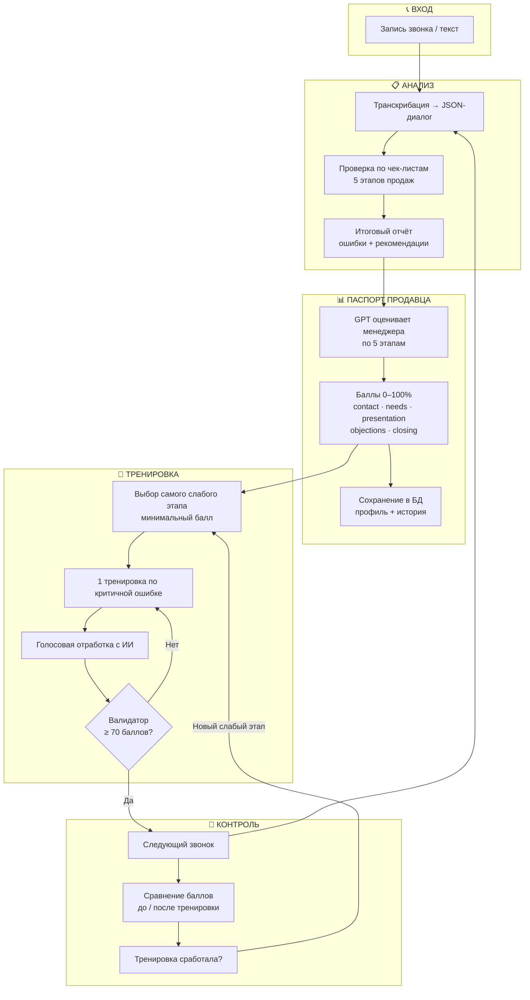
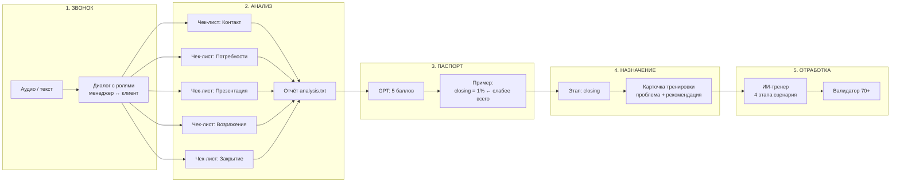
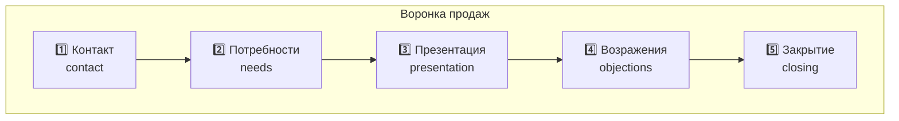
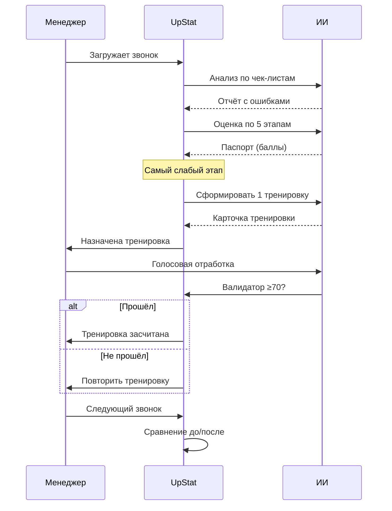
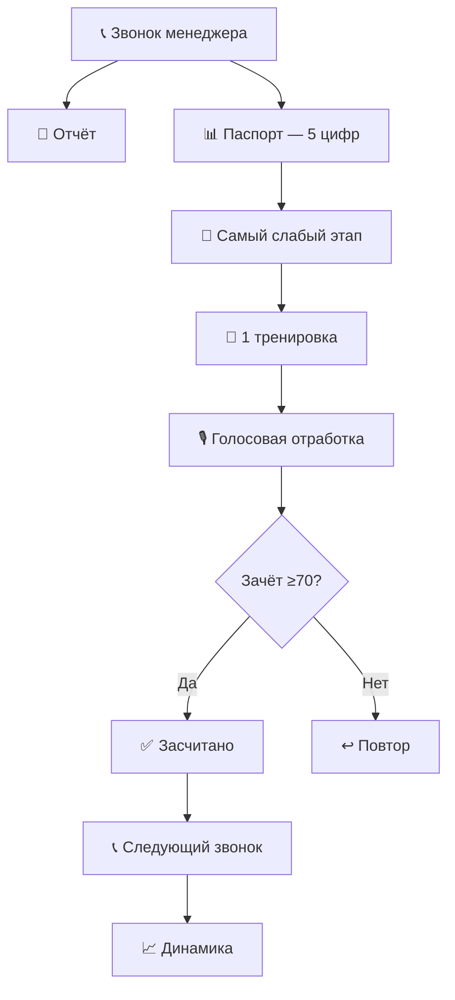

# UpStat — схемы работы системы

Документ для руководства · Май 2026

> **Как использовать:** откройте `.md` в VS Code / Cursor с preview, или используйте HTML-файл для PDF.

---

## 1. Общая схема

---

## 2. Детальная схема по этапам

---

## 3. Пять этапов продаж

| Диапазон | Интерпретация |
|----------|---------------|
| 0–4% | Этап пропущен или провален |
| 5–10% | Критические ошибки |
| 11–25% | Много упущений |
| 26–50% | Средний уровень |
| 51–70% | Хорошо |
| 71–100% | Отлично |

---

## 4. Замкнутый цикл обучения

---

## 5. Что видит руководитель

